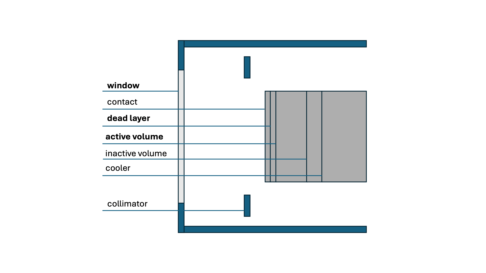

# Detector efficiency
This python project generates a graph with plots showing the estimated quantum efficiency of detectors in function of the energy of incoming photons.
## Usage instructions
### Installation
According to your own preferences you can clone or copy the project to your local files. For instructions on how to clone a project from github see this [guide](https://docs.github.com/en/repositories/creating-and-managing-repositories/cloning-a-repository#cloning-a-repository) (only section 'Cloning a repository' is sufficient). 

Again, according to your own preferences you can install the needed packages/dependencies in an environment (recommended), or not. If you need instructions on how to make an environment and activate it, see my [GitGuide](https://github.com/britthubs/GitGuide/blob/main/Other/virtualenv.md). To install the needed packages/dependencies, in the terminal (make sure you have navigated to the root of the project directory) write:
```
pip install -r requirements.txt
```

### Plotting the graphs
To add a detector to the graph, the following line should be added to the code where stated (see example code lines in the project):
```
plt.plot(energies, quantum_ef(z_w=??, z_c=??, dens_w=??, thck_w=??, dens_c=??, thck_c=??, energies=energies),label="SDD", linewidth=1)
```
The following properties should be filled in (on the placeholder "??" marks.):

`z_w` = atomic number of window element (for example Be would be 4)

`z_c` = atomic number of crystal element (for example Si would be 14)

`dens_w` = density of the window (g/cm3)

`thck_w` = thickness of the window (mm)

`dens_c` = density of the crystal (g/cm3)

`thck_c` = thickness of the crystal (mm)

`energies` = array of energies using np.arrange(start, end, stepsize). The default (energies=energies) is from 1 to 500 keV with stepsize 1 -> np.arange(1, 500, 1)

`label` = the name of the detector that will show up in the legend of the plot, use quotation marks around the name.

After adding the line, run the code and wait for the graph to appear!

## Background
The calculation of the detector efficiency is based on following equation (based on [[1]](#1),[[2]](#2)):

$$\epsilon (E)=e^{-(\mu_{L,w} T_w+\mu_{L,c} T_{dead})}(1-e^{-\mu_{L,c} T_c}) \cdot 100\%$$

This equation is based three areas that have an influence on the detector efficiency: the detector window, the active area within the detector (crystal), and the dead layer. These areas can be seen on following image: 

*This figure is adapted from [[1]](#1).*

It is important to note that other factors (inactive volume, contact...) can have an influence on the detector efficiency, hence why this equation shows an estimated quantum efficiency. The deadlayer thickness is estimated around 0.15 microns.


## References
<a id="1">[1]</a> 
Amptek Inc. Detector Efficiency FAQ. https://www.amptek.com/-/media/ametekamptek/documents/resources/efficiency_faq.pdf?la=en&revision=26e4789d-66ae-42a9-b46d-ce820dd268ed, [Accessed: 10-12-2024].


<a id="1">[2]</a> 
Scholze, F.; Longoni, A.; Fiorini, C.; Strüder, L.; Meidinger, N.; Hartmann, R.; Kawahara, N.; Shoji, T. In Handbook of Practical X-Ray Fluorescence Analysis; Beckhoff, B., habil. Birgit Kanngießer, Langhoff, N., Wedell, R., Wolff, H., Eds.; Springer Berlin Heidelberg, 2006; Chapter X-Ray Detectors and XRF Detection Channels, pp 199–308.